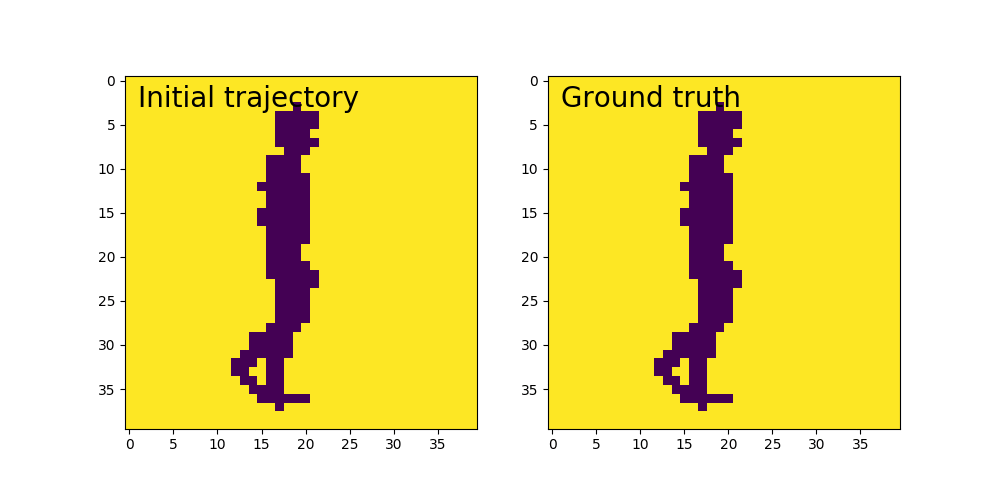

# CCNLSTM
CNN with LSTM to predict next frame

# Starting 
We will utilise the basic Keras Conv_LSTM example and build it. This example creates 1200 15 frame animations of squares moving in a 40x40 window. The basic model is then trained on these examples. Once the training is complete we feed the network the first 7 frames from one of the animations and have it predict the next 8 frames. A comparison is done between the true animation and the one created by the model for those 8 frames.

# Heading to
We will branch off and create our own inputs to the model, they will at first be images resized to 40x40 and be 15frames long for each animation. This should make running them through the model relatively easy. Over time we will resize them to be larger as the assumption would be the cnn can get better information from larger images and hopefully make better guesses for the next frame. 

My plan is to have fun with this and perhaps use short 15 frame anime clips. Perhaps during powerup or fighting scenes. We will see what the model predicts will happen next in the fights:)

The model will likely need to be changed for larger and more complex inputs, perhaps more/different layers. As we go along we will experiment.

# Input creation
Explore the best way to change short clips of movies in to image frames. Create a function that clips movies to a certain number of frames. From quick reading on the subject as long as movement of the subject is not too fast we can prob get away with 12-15 frames per second. So for a 10 second clip it would only require 120-150 frames be extracted.

If we create a function that looks for a movie in each subfolder and then creates the images from that movie and puts them in that subforlder. We can then use our current function that creates tensors from images with a few tweaks to make sure that it only detects the image files (skipping over any movie files).

We could potentially create a single function that takes a movie and converts it all the way to a list of tensors that we can use, perhaps in the long run examine this option.

# Update 10/16/2017
Getting further along with this project. As I have been trying to add more and more animations to train on I am running into OOM errors. I may need to try and create an image generator and flow_from_directory for this project to overcome this. Will look in to this soon.

Below is a GIF of projected animation from learning on a small number of examples. 

